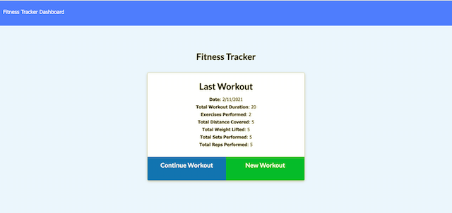
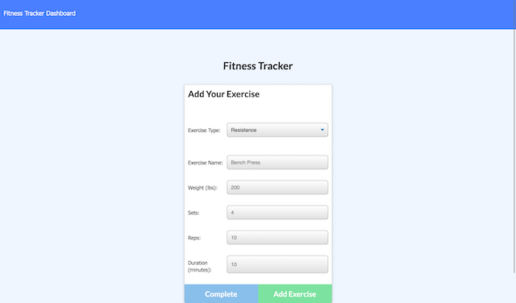
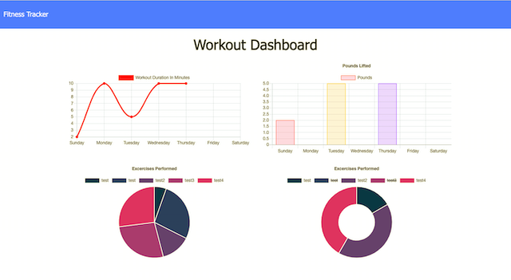

# Unit 18 Nosql Homework: Workout Tracker

## Description

This application allows user to track workout progress and reach fitness goals faster. When the user loads the page, they should be given the option to create a new workout or continue with their last workout.

The user should be able to:

  * Add exercises to a previous workout plan.

  * Add new exercises to a new workout plan.

  * View the combined weight of multiple exercises on the `stats` page, displayed as charts.

Check out the deployed link on Heroku [here](https://workout-tracker-by-uyen.herokuapp.com/).

### User Story

```
As a user, I want to be able to view create and track daily workouts. 
I want to be able to log multiple exercises in a workout on a given day. 
I should also be able to track the name, type, weight, sets, reps, and duration of exercise. 
If the exercise is a cardio exercise, 
I should be able to track my distance traveled.
```

### Technologies

* Express
* Mongoose

### Screenshots







## Credits

This application is built by me with the initial front end materials given by Trilogy.
